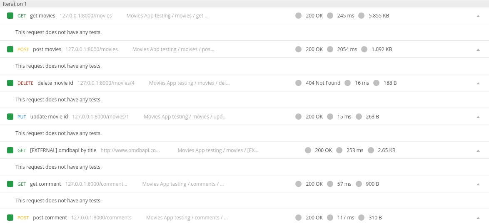
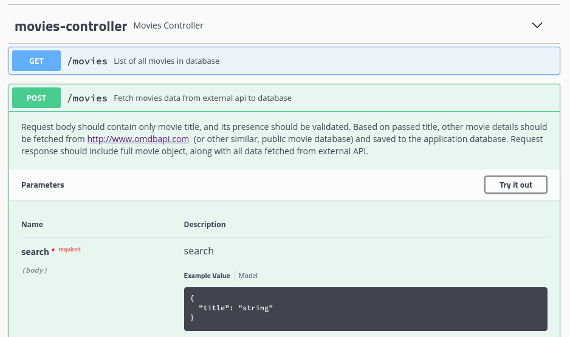

# Simple Movie API application 
Here is a simple REST API application about movies.

## Specifications
We'd like you to build a simple REST API​ ​ - a basic movie database interacting with external
API.

Here's the specification of endpoints that we'd like it to have:

**POST /movies:**

-​ Request body should contain only movie title, and its presence should be
validated.
- Based on passed title, other movie details should be fetched from
http://www.omdbapi.com ​ (or other similar, public movie database) - and saved to the
application database.
- Request response should include full movie object, along with all data fetched from
external API.

**GET /movies:**
- ​ Should fetch a list of all movies already present in the application database.
- Additional filtering, sorting is fully optional - but some implementation is a
bonus.

**DELETE /movies/<movie-id>/:**
- ​ Get the movie if it exists and then delete it and returning a response.
UPDATE /movies/<movie-id>/:
- Update the movie by sending a PUT request to the URL with the data you want to
update.

**POST /comments:**
- ​ Request body should contain ID of movie already present in database, and comment
text body.
- Comments should be saved to the application database and returned in request
response.

**GET /comments:**
- ​ Should fetch a list of all comments present in the application database.- Should allow filtering comments by associated movie, by passing its ID.

**GET /top:**
- ​ Should return top movies already present in the database ranking based on a number
of comments added to the movie (as in the example) in the specified date range. The
response should include the ID of the movie, position in rank and total number of
comments (in the specified date range).
- Movies with the same number of comments should have the same position in the
ranking.
- Should require specifying a date range for which statistics should be generated.

## Technologies used
Java version 14

SpringBoot  (initialized with spring [initializr](https://start.spring.io/))

Maven :
- dependencies :
    - spring boot starter web/jpa/test
    - springfox : generate swagger documentation
    - jackson : json manipulation
    - <del>mariadb-java-client : persistence </del> replaced by H2 for easy installation
    - h2 : persistence <del>(test only)</del>
    - mockito : mocking (test only)
    - junit : for testing purpose(test only)
    - lombok : clean code
- plugins :
    - spring boot maven plugin
    - sonar-maven-plugin : for easy implementation of Sonarqube
    - jacoco : to get metrics of code coverage

Docker :
- services :
    - movie-app : spring boot app
    - <del> db : mariadb, database for persistence </del> replaced by H2
    - sonarqube : code quality tool
    - sonar_db : database necessary for sonar
    

## Launch application

### Launch application with docker-compose
#### Build & Run Movie App
Execute these commands :

`docker-compose build --no-cache movie-app` 
( This could take few minutes the first time as it has to download all dependencies)

`docker-compose run --service-ports movie-app`

NB :`--service-ports` argument is needed to access container from `127.0.0.1`.
Once these commands executed, spring boot app is listening on port 8000.

### Launch application without docker
You will need maven installed on your PC and a JDK version 14.

build :

`mvn clean package`

run :

`java -jar ./target/movies-0.0.1-SNAPSHOT.jar`

### Launch SonarQube analysis
SonarQube has to be up on port 9000. 
You can use this command to have a docker container running a SonarQube server:

`docker-compose run sonarqube`

Then you can launch this command to run analysis :
`mvn clean verify sonar:sonar`

Visit the link to check sonar analysis :
`http://localhost:9000/`

## Documentation 
### Postman
In folder`./doc/` you can find a `postman_collect.json`. Use Postman import functionality to use it.  

### Swagger 
Once application launched you can access to swagger by following this URL :
`http://localhost:8000/swagger-ui.html`

## Travis CI pipeline 
Travis pipeline is used here to verify that all tests are OK when i commit something.
You can check pipelines status by clicking on this image :

## License 

Copyright 2020 Dangleterre Thomas

Licensed under the Apache License, Version 2.0 (the "License");
you may not use this file except in compliance with the License.
You may obtain a copy of the License at

   http://www.apache.org/licenses/LICENSE-2.0

Unless required by applicable law or agreed to in writing, software
distributed under the License is distributed on an "AS IS" BASIS,
WITHOUT WARRANTIES OR CONDITIONS OF ANY KIND, either express or implied.
See the License for the specific language governing permissions and
limitations under the License.